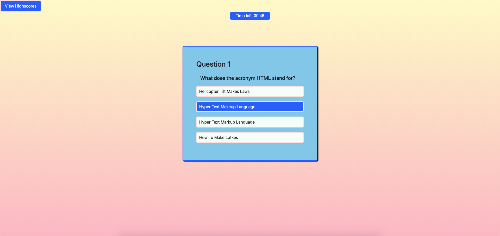

# Coding Quiz - A timed code quiz for your enjoyment

It was our goal to create a coding quiz in which users could test their programming knowledge with in an interactive way. Upon the page loading, users are greeted with a window displaying a START button, that they may then click to begin their quiz.

Starting the quiz also sets off a timer, which will count down over the course of one minute as the user completes their questions. However, if the quiz taker selects an incorrect answer, time will be deducted from the count down, thus making it more difficult for the user to finish all of the questions.

After they complete the quiz, users will be prompted with a Highscores window in which they may enter a name to the scoreboard containing their relative score. If a user would like to check the Highscores leaderboard, they can do so via the 'View Highscores' button located in the top left corner of the page. The scoreboard remembers previous scores, and provides an option to clear the leaderboard to make room for newer highscores.

Test your knowledge [here!](https://jimbopulos.github.io/timed-quiz/)
