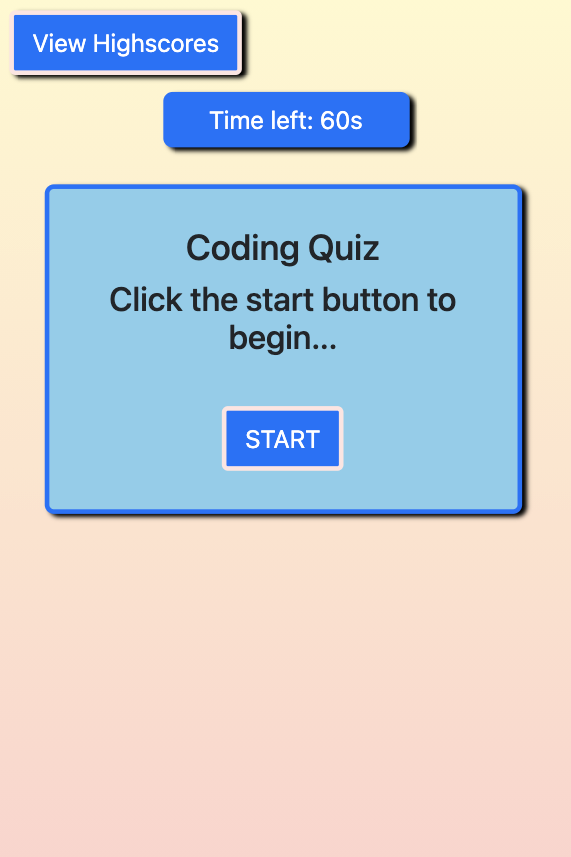

# Coding Quiz - A timed code quiz for your enjoyment

## Description

Test your programming knowledge with this short and fun quiz!

## Table of Contents

- [Installation](#installation)
- [Usage](#usage)
- [Technologies](#technologies)
- [Deployed URL](#deployed-url)
- [License](#license)

## Installation

Navigate the [deployed URL](#deployed-url) to begin using this app.

## Usage

1. To begin, click the `START` button

2. Answer each of four questions:

- Correct answers will invoke a correct answer noise and add 10 points to your total score, with no time penalty
- Incorrect answers will invoke an incorrect answer noise, no points, and result in a penalty of 15 seconds from the countdown timer

3. After you finish, get your initials on the leaderboard by typing, then clicking `Submit`

- To view the high scores leaderboard, click the `View Highscores` button in the upper left hand corner of the page.
- The highscores leaderboard may be cleared by clicking `Clear highscores`

> Quiz START

> Questions

> Highscores

## Technologies

- `HTML`
- `CSS` and `Bootstrap`
- `JavaScript`

## Deployed URL

**Test your knowledge [here!](https://jimbopulos.github.io/timed-quiz/)**

## Questions

If you have any questions, please contact jimbopulos at james.mgalantino@gmail.com

## License

MIT License

Copyright (c) 2021 James Galantino

Permission is hereby granted, free of charge, to any person obtaining a copy
of this software and associated documentation files (the "Software"), to deal
in the Software without restriction, including without limitation the rights
to use, copy, modify, merge, publish, distribute, sublicense, and/or sell
copies of the Software, and to permit persons to whom the Software is
furnished to do so, subject to the following conditions:

The above copyright notice and this permission notice shall be included in all
copies or substantial portions of the Software.

THE SOFTWARE IS PROVIDED "AS IS", WITHOUT WARRANTY OF ANY KIND, EXPRESS OR
IMPLIED, INCLUDING BUT NOT LIMITED TO THE WARRANTIES OF MERCHANTABILITY,
FITNESS FOR A PARTICULAR PURPOSE AND NONINFRINGEMENT. IN NO EVENT SHALL THE
AUTHORS OR COPYRIGHT HOLDERS BE LIABLE FOR ANY CLAIM, DAMAGES OR OTHER
LIABILITY, WHETHER IN AN ACTION OF CONTRACT, TORT OR OTHERWISE, ARISING FROM,
OUT OF OR IN CONNECTION WITH THE SOFTWARE OR THE USE OR OTHER DEALINGS IN THE
SOFTWARE.
